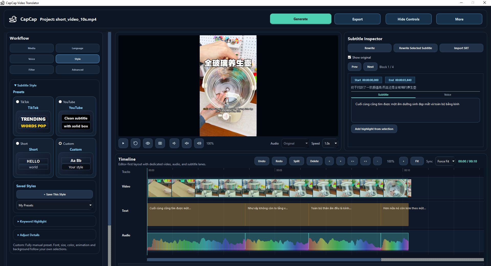

# CapCap 🦆



CapCap is a Windows desktop app for short-form video localization and dubbing. It brings transcription, translation, subtitle styling, voice generation, timeline editing, preview, and export into a single project workflow for Vietnamese-focused content production.

## Core Features

- Project-based workflow with resume support
- Three output modes: `subtitle only`, `voice only`, `subtitle + voice`
- Speech-to-text with `faster-whisper` (local or remote backend)
- Subtitle translation and rewrite with local / remote AI support (Gemma4, Qwen 3.5)
- AI polish and subtitle rewrite tools for timing-friendly phrasing
- Vietnamese voice generation with `Piper`, `edge-tts`, and `F5` voice cloning
- **Single-line subtitle (Netflix style)** — auto-split long subtitles into short reading chunks
- Separate subtitle text and voice text editing
- Subtitle highlight styling and preset-driven subtitle looks
- Video filter support for preview and export workflows
- Audio mix and export with `FFmpeg`
- Live video preview with subtitle overlay
- Timeline editing for subtitle, audio, and video alignment
- **Smart Generate** — single button auto-detects needed pipeline steps
- **Per-segment voice regeneration** — regenerate + update voice for any segment
- **Remote mode** for offloading ALL heavy processing (Whisper + AI + TTS + Export) to a backend API server
- **Model auto-unloading** — frees VRAM after processing, prevents OOM crashes
- **CAPCAP_QUIET** env var to suppress verbose server logs

## Editor UI

### Top Header
- `Generate` — smart button: runs transcription + translation (if needed), then voice + preview
- `Export` — final video/subtitle export
- `More` — Subtitle download, Original script download, **Exit** (back to launcher), Clean project, Settings

### Left Panel
- `Media` — video, audio, background music, output quality, aspect ratio, canvas (Fit/Fill), **Reset Framing**
- `Language` — source/target language, Whisper model
- `Voice` — engine, gender, speed, voice preview
- `Style` — TikTok, YouTube, Short, Custom presets, font, color, alignment, background box, **Single-line subtitle (Netflix)**
- `Filter` — video filters (blur, brightness, contrast, etc.)
- `Advanced` — audio handling, F5 reference audio, ducking, timing sync (moved to timeline header)

### Center Preview
- Video player with live subtitle overlay
- Play/Pause, Reset, Preview, Blur area controls
- Speed and audio track selection

### Subtitle Inspector (Right Panel)
- `Rewrite` — open dialog with style presets and AI prompt for full script
- `Rewrite Selected Subtitle` — open dialog with style presets for current segment only
- `Import SRT`
- `Show original` checkbox
- Prev/Next navigation with block counter
- Card with timing info, original text, and tabbed editor:
  - `Subtitle` tab — text editor, highlight selection
  - `Voice` tab — spoken text editor, `Use voice for subtitle`, `Regenerate voice`

### Timeline
- Multi-lane: Subtitle, Audio, Video
- Undo/Redo, Split, Delete, Nudge, Ripple controls
- Zoom and Fit controls
- **Voice timing sync** combo (Off/Smart/Force Fit)
- Time display

## Technical Stack

- `PySide6` for desktop UI
- `libmpv` / media backend for preview
- `QThread` workers for background processing
- `faster-whisper` for local ASR
- `FFmpeg` for extract, mix, mux, export
- `Demucs` for vocal/background separation
- `Piper TTS`, `edge-tts`, and `F5-TTS`
- `llama-cpp-python` for local AI rewrite / polish
- `requests` for remote integrations
- `PyInstaller` for packaging

## Server Startup (Windows Terminal)

Double-click `run_servers_terminal.bat` to start both API servers in one window:

```
┌────────────────────┐
│  Remote API :8765  │
├────────────────────┤
│  F5 API     :8766  │
└────────────────────┘
```

## Remote API Endpoints

| Endpoint | Purpose |
|---|---|
| `POST /v1/prepare` | Transcription + translation workflow |
| `POST /v1/voice` | TTS synthesis + audio mix |
| `POST /v1/export` | Final video export |
| `POST /v1/unload` | Free all cached models from VRAM/RAM |
| `POST /v1/tts/synthesize` | Single-segment TTS |
| `POST /v1/transcribe` | Speech-to-text |
| `POST /v1/translate-*` | Translation endpoints |

## Key Environment Variables (`.env`)

| Variable | Default | Description |
|---|---|---|
| `AI_POLISHER_PROVIDER` | `local` | AI provider: `local` (GGUF) or `gemini` |
| `CAPCAP_QUIET` | `false` | Set `true` to suppress remote API logs |
| `CAPCAP_WHISPER_DEVICE` | (auto-detect) | Force `cpu` to avoid CUDA conflicts |
| `CAPCAP_REMOTE_API_URL` | `http://127.0.0.1:8765` | Remote API address |
| `CAPCAP_REMOTE_API_PORT` | `8765` | Remote API port |
| `CAPCAP_REMOTE_API_TOKEN` | (none) | Auth token for remote API |
| `LOCAL_TRANSLATOR_MODEL_PATH` | `models/ai/...` | Path to GGUF model file |
| `LOCAL_TRANSLATOR_TEMPERATURE` | `0.15` | LLM temperature for translation |
| `GEMINI_API_KEY` | (none) | Google Gemini API key |
| `GEMINI_MODEL` | `gemini-2.0-flash` | Gemini model name |

## Run From Source

```bash
git clone https://github.com/notepower2k1/CapCap.git
cd CapCap
pip install -r requirements-local.txt
python ui/gui.py
```

### Remote Client
```bash
pip install -r requirements-remote.txt
python ui/gui_remote.py
```

### Remote Server
```bash
pip install -r requirements-server.txt
python app/remote_api_server.py
```
Or use `run_servers_terminal.bat` for both API servers in one terminal window.

## Workflow

1. Load a video and choose the source and target language.
2. Generate subtitles, translation, or voiceover assets.
3. Review subtitle styling, timing, and voice text in the editor.
4. Fine-tune segments in the subtitle inspector and timeline.
5. Preview the result, then export subtitles, dubbed audio, or the full video.

## Key Files

```
CapCap/
├── ui/
│   ├── gui.py                    # Main app entry point
│   ├── gui_remote.py             # Remote client entry point
│   ├── main_window.py            # Main window, controllers, signal wiring
│   ├── controllers/              # Pipeline, preview, subtitle controllers
│   ├── views/                    # UI layout builders
│   │   ├── main_window.py        # Main window layout + signal connections
│   │   ├── start_panel.py        # Left panel (media, voice, style, etc.)
│   │   ├── preview_panel.py      # Right panel (preview + inspector + timeline)
│   │   └── advanced_tabs.py      # Advanced settings tab
│   ├── widgets/                  # Custom widgets (timeline, video, overlay)
│   ├── worker_adapters/          # QThread worker classes
│   ├── helpers/                  # SRT helpers, presentation helpers
│   └── utils/                    # Icon, media, settings utilities
├── app/
│   ├── remote_api_server.py      # Backend API server
│   ├── f5_api_server.py          # F5 voice synthesis API server
│   ├── workflows/                # Prepare, voice, export workflows
│   │   └── voice_workflow.py     # TTS + timing sync + retry logic
│   ├── translation/              # Translation orchestrator + providers
│   │   ├── orchestrator.py       # Main translation pipeline
│   │   └── providers/
│   │       └── local_polisher.py # Local GGUF AI prompts + inference
│   ├── whisper_processor.py      # Whisper ASR with CUDA/CPU fallback
│   ├── audio_mixer.py            # Voice track builder + time-stretch
│   ├── translator.py             # Translation API
│   └── subtitle_builder.py       # SRT/ASS export
├── run_servers_terminal.bat      # Windows Terminal server launcher
├── .env                          # Environment configuration
└── .env_example                  # Example environment config
```

## Packaging

```bash
python -m PyInstaller CapCap.spec --noconfirm --clean        # Local release
python -m PyInstaller CapCap.remote.spec --noconfirm --clean  # Remote client
python -m PyInstaller CapCap.server.spec --noconfirm --clean  # Server
```

## CUDA Requirements

GPU acceleration is **strongly recommended** for a smooth experience but not strictly required.

| Component | GPU recommended | Notes |
|---|---|---|
| **faster-whisper** | Optional | CPU works but is much slower; GPU (CUDA 11/12) speeds up transcription significantly |
| **Demucs** | Recommended | Vocal separation on CPU is very slow; GPU inference is preferred |
| **F5-TTS** | **Required** for cloning | F5 voice cloning is practically unusable on CPU; needs CUDA-capable GPU |
| **llama-cpp-python** | Optional | Local LLM inference can use CPU; GPU (CUDA) speeds up translation/polish |

**Minimum:** NVIDIA GPU with Compute Capability >= 5.0 (e.g., GTX 1050 Ti) and CUDA toolkit installed.
**Recommended:** RTX 2060 or better with at least 6GB VRAM.

For CPU-only setups, expect transcription and voice synthesis to be significantly slower.

## License

Apache License 2.0. See [LICENSE](./LICENSE).

## Resource

[Hugging Face](https://huggingface.co/Hacht/CapCapResource)

## Notes

- Optimized for Windows.
- Remote mode offloads entire pipeline to backend API server. Remote GUI only needs PySide6 + FFmpeg + MPV.
- F5 voice cloning requires reference audio + reference text.
- Set `CAPCAP_WHISPER_DEVICE=cpu` in `.env` if CUDA hangs in threaded server context.
- Set `CAPCAP_QUIET=true` to suppress server console logs.

## References

This project builds on and references the following open-source projects:

- [F5-TTS-Vietnamese](https://github.com/nguyenthienhy/F5-TTS-Vietnamese) — Vietnamese voice cloning
- [llama-cpp-python](https://github.com/JamePeng/llama-cpp-python) — Local LLM inference
- [vietnormalizer](https://github.com/nghimestudio/vietnormalizer) — Vietnamese text normalization
- [faster-whisper](https://github.com/SYSTRAN/faster-whisper) — Speech-to-text transcription
- [piper](https://github.com/rhasspy/piper) — Local text-to-speech synthesis
- [demucs](https://github.com/facebookresearch/demucs) — Vocal/background audio separation