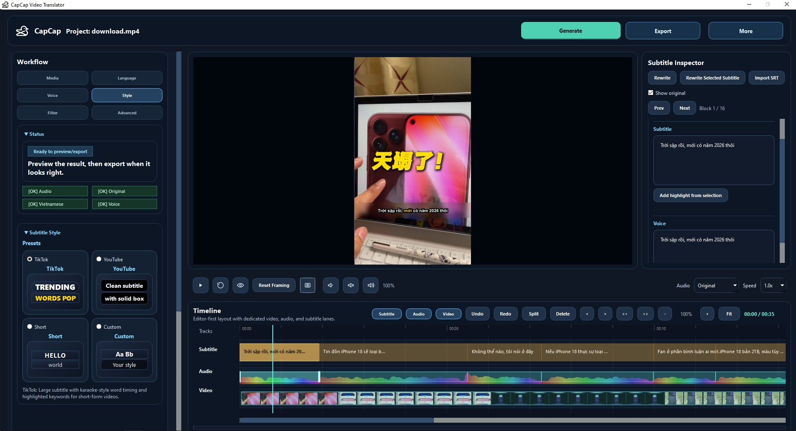

# CapCap



CapCap is a Windows desktop app for short-form video localization and dubbing. It brings transcription, translation, subtitle styling, voice generation, timeline editing, preview, and export into a single project workflow for Vietnamese-focused content production.

## Current Preview

The current editor combines workflow controls, subtitle style presets, a centered video preview, a subtitle inspector, and a multi-lane timeline in one screen so subtitle and voiceover work can be reviewed side by side.

## Core Features

- Project-based workflow with resume support
- Three output modes:
  - `subtitle only`
  - `voice only`
  - `subtitle + voice`
- Speech-to-text with `faster-whisper`
- Subtitle translation and rewrite with local / remote AI support
- AI polish and subtitle rewrite tools for timing-friendly phrasing
- Vietnamese voice generation with `Piper`, `edge-tts`, and `F5` voice cloning
- Separate subtitle text and voice text editing
- Subtitle highlight styling and preset-driven subtitle looks
- Video filter support for preview and export workflows
- Audio mix and export with `FFmpeg`
- Live video preview with subtitle overlay
- Timeline editing for subtitle, audio, and video alignment
- Remote mode for offloading heavy `Whisper + AI` work to another PC

## Editor UI / Tools

The current desktop editor includes:

- Top header actions:
  - `Generate`
  - `Export`
  - `More`
- Left workflow panel:
  - `Media`
  - `Language`
  - `Voice`
  - `Style`
  - `Filter`
  - `Advanced`
- Always-visible `Status` summary card
- Subtitle style preset cards for `TikTok`, `YouTube`, `Short`, and `Custom`
- Center video preview with live subtitle overlay
- Playback and framing controls under the preview
- Right-side `Subtitle Inspector` with rewrite, import, highlight, subtitle, and voice editing tools
- Multi-lane timeline for:
  - `Subtitle`
  - `Audio`
  - `Video`

Current editor interactions:

- Preview subtitle timing directly against the rendered video
- Select subtitle blocks from the timeline or inspector
- Rewrite the full script or a selected subtitle block
- Edit subtitle and voice text independently
- Add highlight styling from the selected subtitle text
- Split, delete, nudge, zoom, and fit timeline segments before export
- Switch subtitle style presets while reviewing the live preview
- Prepare export-ready subtitle timing without leaving the main editor

`More` menu actions include project utilities such as subtitle/script visibility, cleanup, and settings.

## Technical Stack

- `PySide6` for desktop UI
- `libmpv` / media backend for preview
- `QThread` workers for background processing
- `faster-whisper` for local ASR
- `FFmpeg` for extract, mix, mux, export
- `Demucs` for vocal/background separation
- `Piper TTS`, `edge-tts`, and `F5-TTS`
- `llama-cpp-python` for local AI rewrite / polish
- `requests` for remote integrations
- `PyInstaller` for packaging

## Workflow

1. Load a video and choose the source and target language.
2. Generate subtitles, translation, or voiceover assets.
3. Review subtitle styling, timing, and voice text in the editor.
4. Fine-tune segments in the subtitle inspector and timeline.
5. Preview the result, then export subtitles, dubbed audio, or the full video.

## Run From Source

Clone the repo:

```bash
git clone https://github.com/notepower2k1/CapCap.git
cd CapCap
```

Install a profile:

### Local

```bash
pip install -r requirements-local.txt
python ui/gui.py
```

### Remote Client

```bash
pip install -r requirements-remote.txt
python ui/gui_remote.py
```

### Remote Server

```bash
pip install -r requirements-server.txt
python app/remote_api_server.py
```

## Packaging

### Local release

```bash
python -m PyInstaller D:\CodingTime\CapCap\CapCap.spec --noconfirm --clean
```

### Local debug

```bash
python -m PyInstaller D:\CodingTime\CapCap\CapCap.debug.spec --noconfirm --clean
```

### Remote client

```bash
python -m PyInstaller D:\CodingTime\CapCap\CapCap.remote.spec --noconfirm --clean
```

### Server

```bash
python -m PyInstaller D:\CodingTime\CapCap\CapCap.server.spec --noconfirm --clean
```

## Repo Guide

See [structure.md](./structure.md) for a codebase map and important entrypoints.

## License

This project is licensed under the Apache License 2.0. See [LICENSE](./LICENSE).

## Notes

- The app is currently optimized for Windows.
- Some AI, ASR, separation, and voice synthesis steps can be slow on weaker machines.
- Remote mode currently focuses on `Whisper + AI translation/rewrite`; preview and export still run locally on the client.
